# 社群網路-實作小說人物關係網路
## 量化社群網路

社群網路(Social network)模型，是由許多節點(node)以及邊(edge)構成的圖型結構(graph)，於各領域有不同面向的探討。套用在交際分析上，以node代表人，edge代表關係。

關於其概念，可閱讀下列文章：
[巨量資料中的小世界–漫談社群網路](https://ee.ntu.edu.tw/upload/hischool/doc/2014.05.pdf "巨量資料中的小世界–– 漫談社群網路 - 台大電機系")

下列幾項指標可量化描述一個網路
* Degree
* Path length
* Clustering coefficient

### Degree

  * Average Degree

    Degree是指一個node上所連接的edge數，而average degree指整個網路中的平均。  
    
  * Degree Distribution  
    可描述整個網路degree分布情況。

### Path length

圖型上兩點間未必只有單一路徑，故以最短路徑進行評估。最短路徑記作

而兩點間的距離，又可稱作離心距(Eccentricity)。意思是若有A.B兩點，可視為A點當中心，如此B點到中心(A點)的距離即稱之離心距。

* Diameter

  Diameter是一圖型上最長的一條最短路徑 (同時是最長的Eccentricity)。記作

  

### Clustering coefficient
* Global clustering coefficient : 整體網路的群聚度

  

* Average clustering coefficient : 量化網路內某node和相鄰node的群聚度，取其總平均

  
  ，
  

  |以此圖為例： 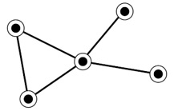 |
  |--|
  * Global clustering coefficient : 
  
  * Average clustering coefficient : 

---

## 實作小說人物關係網路
在此對笑傲江湖這本小說內的人物建立社群網路，會形成一無向圖之網路。而點(node)與邊(edge)所代表之意義如下。
* node：每一個node是一位人物，而列出的人物表以 [wiki-笑傲江湖角色列表頁面](https://zh.wikipedia.org/wiki/%E7%AC%91%E5%82%B2%E6%B1%9F%E6%B9%96%E8%A7%92%E8%89%B2%E5%88%97%E8%A1%A8 "角色列表") 中列出的主要人物為基準，剔除重複後共211個。
* edge：角色人物在同一段文章內出現，則存在關係，建立edge。

列出下列幾項結果
* Average degree
* Diameter
* Average clustering coefficient
* Visualization

### Average degree
node與edge關係的定義如上，經由整理後可列出各點間之連結關係。

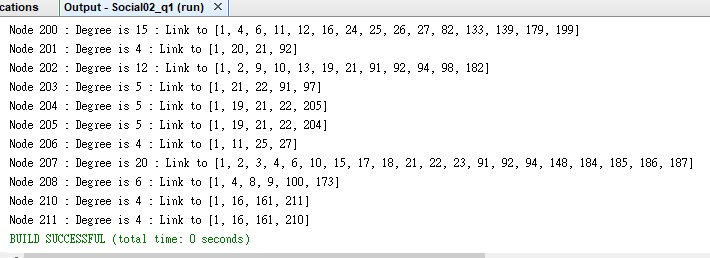

如此可算出 Average Degree  
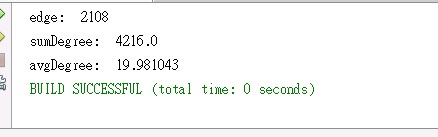  
此網路中的平均連結度是將近20。

以及 Degree Distribution  
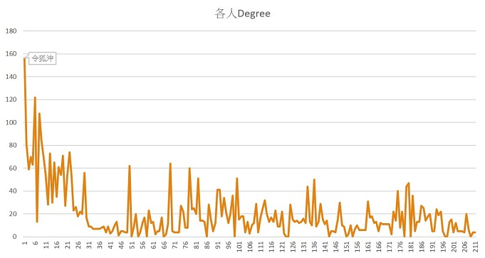

從這張圖能說明此處的小說人物關係網路仍是有power law趨勢存在。power law套用在社群網路中是在描述網路中的大多數node其連結度都是偏少的，但也有不少連結度極大的node存在。

### Diameter
找出Diameter的方法

* 方法一  
最直覺的是窮舉法，依序由各node找出離此點最遠的一點。即是對此node的diameter，若有新的更大diameter值出現則更新整個網路之diameter。缺點是各node都要計算，較為耗時。
* 方法二  
起初亂數選取某Node，以此Node為起點作diameter搜尋(BFS找最長之最短路徑)，找到終點時再以此終點做為起點再次進行反向搜尋，如此來回反覆作，即可找到對於整個網路之最長最短路徑，即diameter。  
僅搜尋一次時雖然無法立即找出正確diameter，但相較於方法一卻可大幅減少搜尋次數，縮短計算時間。

|小說人物網路_找diameter|
|:--:|
|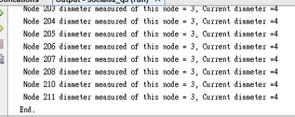|
|對於整體網路是 diameter=4|

對於網路規模一般的社群，窮舉便可解決。但對於規模十分龐大的資料集就有其必要性。  
如網路上公開的 [DBLP co-author資料集](https://www.google.com/search?q=dblp+co-author&oq=dblp+co-author&aqs=chrome..69i57j69i60j69i59l2j0j69i59.559j0j7&sourceid=chrome&ie=UTF-8 "資料集 node:317,080、edge:1,049,866") 資料量達百萬筆；於下方示範差異

|DBLP_方法一|DBLP_方法二|
|:--:|:--:|
|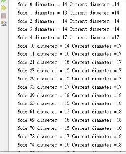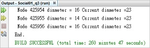|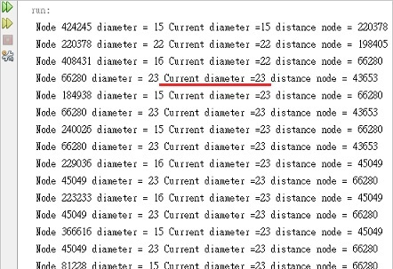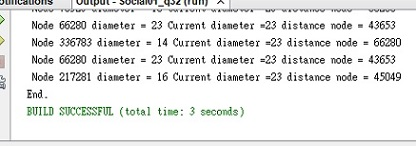|
|逐項做完，歷時達260分鐘|執行數次後就能找到|

### Average clustering coefficient
找triangle的方法：  
(第一層)先對某一目標，找出它ArrayList內的元素 (例 :上方圖示中 Node 211. Link to[1, 16, 161, 210] )。  
(第二層)再依序對ArrayList內的元素搜索，檢查是否有包含Node 211 內的其它元素 。  
若有找到即是一三角形 。

如此可算出 ***number of triangles on vertex i***；在此小說人物關係網路之Average clustering coefficient如下。

|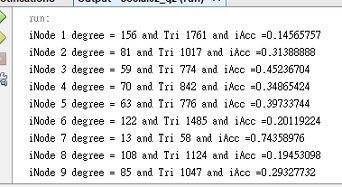|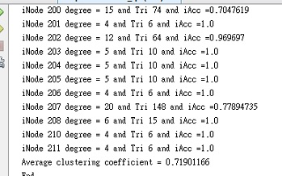|
|--|--|

### Visualization
依笑傲江湖腳色列表的標記做區分

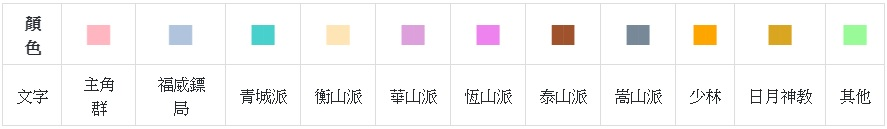

[Demo: visualization by vis.js](netpage/index.html "by visjs.org")

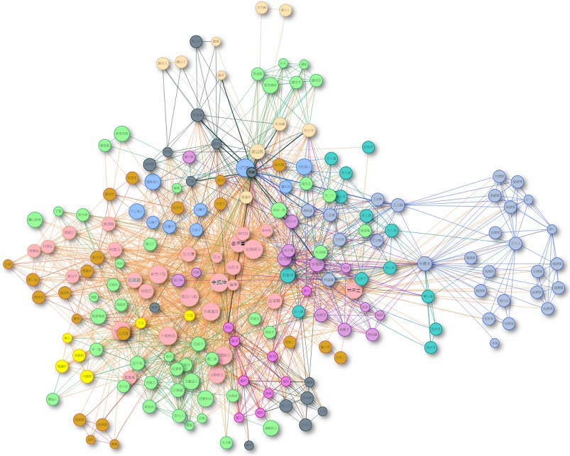

---
# reference

[Network Science](https://en.wikipedia.org/wiki/Network_science "Network Science-wiki")  
[Clustering coefficient](https://en.wikipedia.org/wiki/Clustering_coefficient "Clustering coefficient-wiki")  
